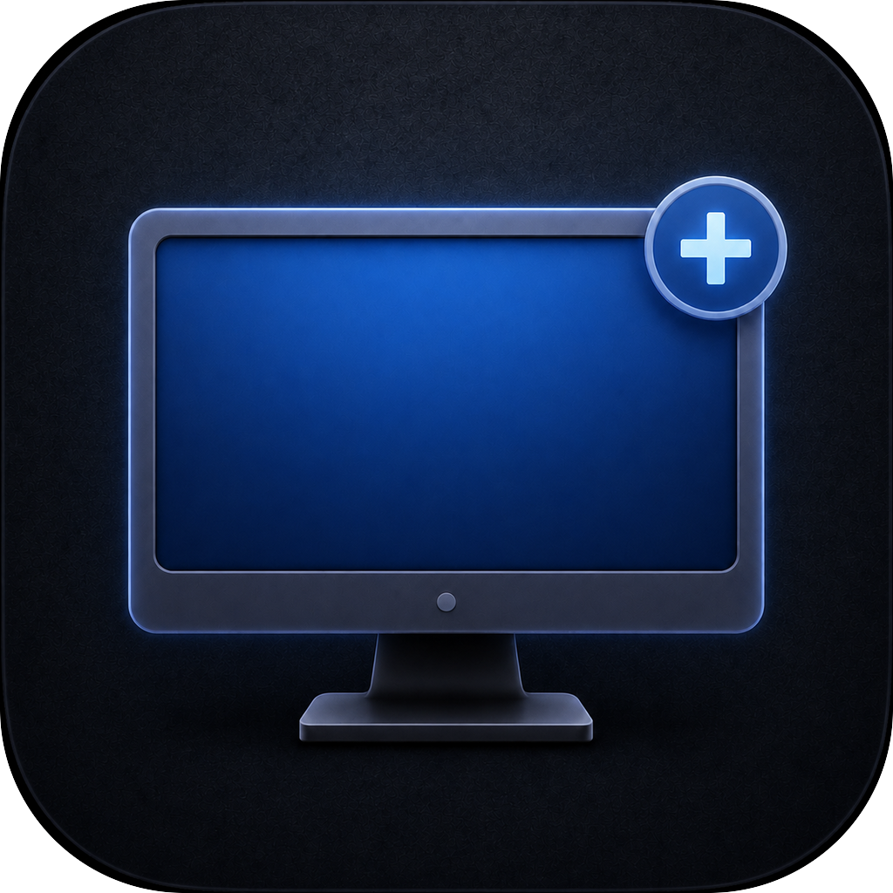
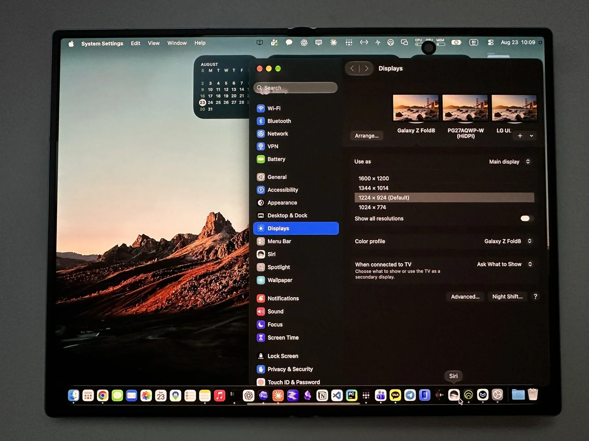
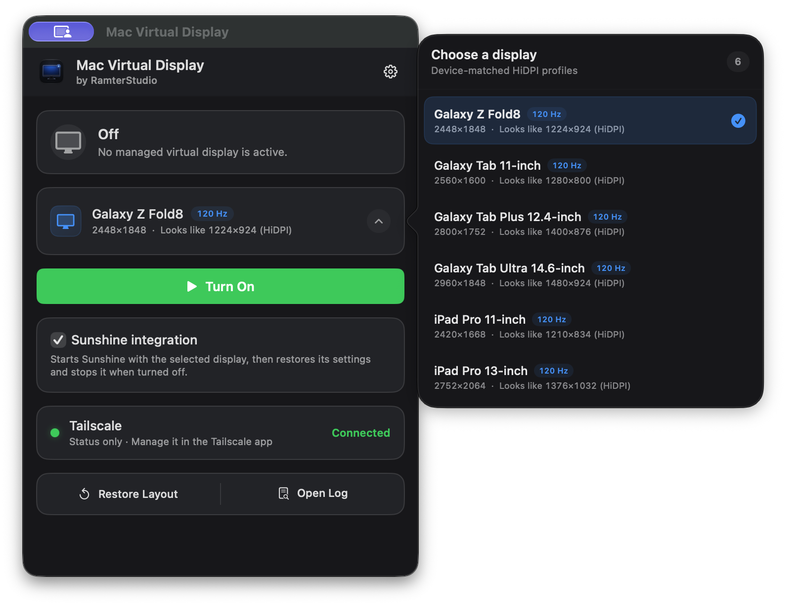
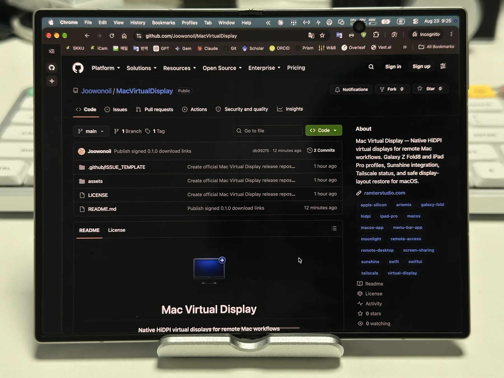
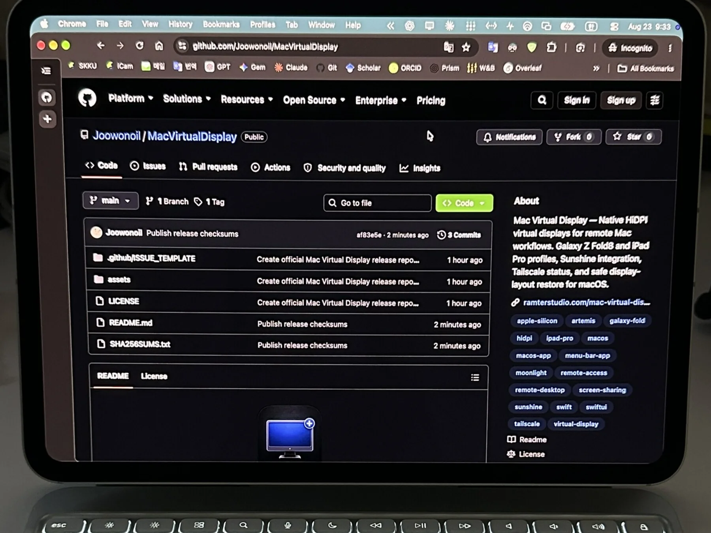
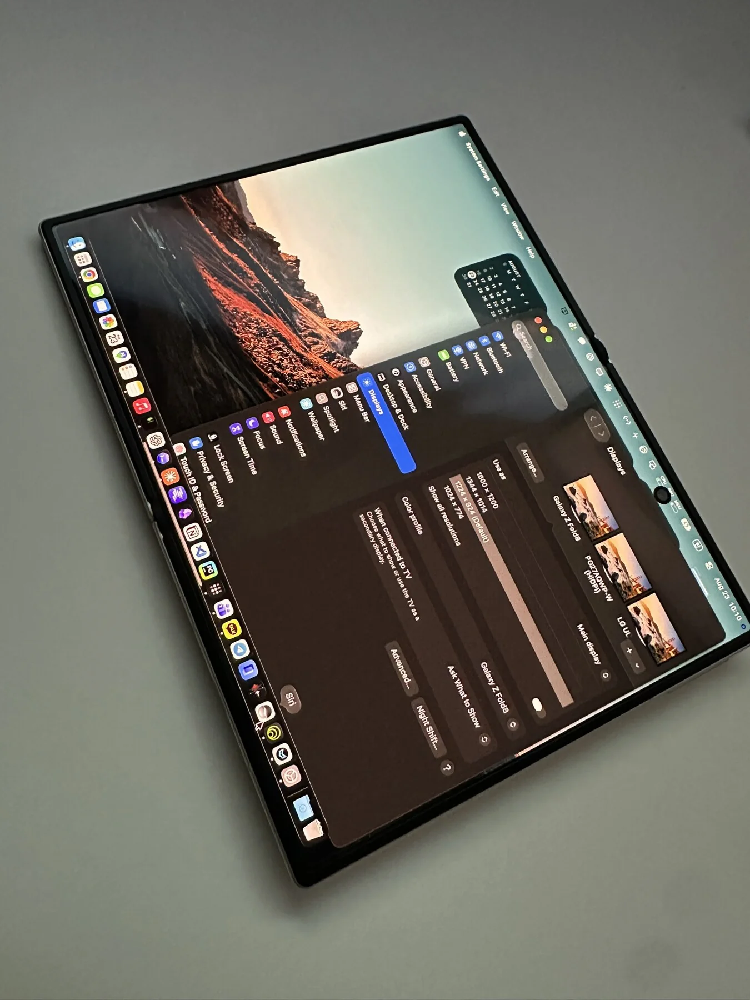
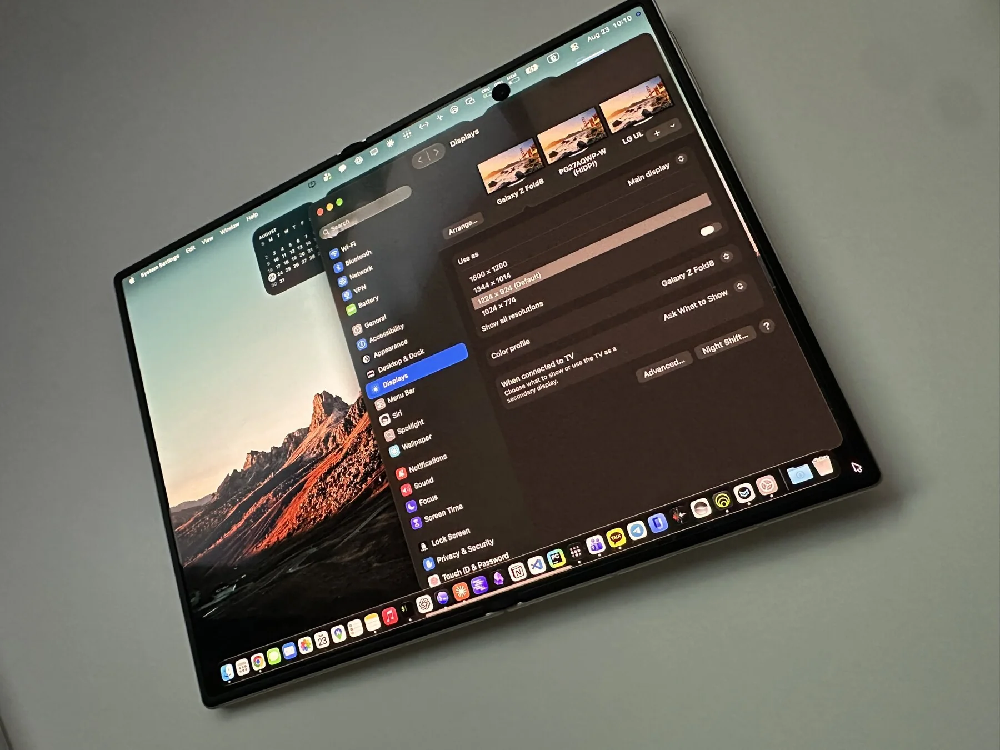

  

<h1 align="center">Mac Virtual Display</h1>

  <strong>Native HiDPI virtual displays for remote Mac workflows</strong> 
  Create device-matched virtual displays for Galaxy Z Fold8, Galaxy Tab, and iPad Pro, manage them from the menu bar, and optionally coordinate Sunshine streaming with safe display-layout restore.

  
  
  
  

  <a href="https://ramterstudio.com/assets/macvirtualdisplay/MacVirtualDisplay.dmg">Download</a> ·
  <a href="https://github.com/Joowonoil/MacVirtualDisplay/releases">Releases</a> ·
  <a href="https://ramterstudio.com/mac-virtual-display/">Website</a> ·
  <a href="https://github.com/Joowonoil/MacVirtualDisplay/issues">Feedback</a>

  

> This is the official release, documentation, and issue-tracking repository for Mac Virtual Display. The application is proprietary; its source code is not published here.

> Download only from this repository or the official RamterStudio website. Development builds are not distributed publicly.

  

## Why Mac Virtual Display?

Remote-streaming quality depends on the Mac rendering a display that matches the client device. A mismatched physical monitor can introduce letterboxing, scaling, or an awkward desktop size.

Mac Virtual Display creates tested HiDPI profiles for remote devices and keeps the display workflow in one menu bar app.

## Display Profiles

| Device | Native resolution | HiDPI workspace | Refresh rate |
|---|---:|---:|---:|
| **Galaxy Z Fold8** | 2448 × 1848 | Looks like 1224 × 924 | 120 Hz |
| **Galaxy Tab 11-inch** | 2560 × 1600 | Looks like 1280 × 800 | 120 Hz |
| **Galaxy Tab Plus 12.4-inch** | 2800 × 1752 | Looks like 1400 × 876 | 120 Hz |
| **Galaxy Tab Ultra 14.6-inch** | 2960 × 1848 | Looks like 1480 × 924 | 120 Hz |
| **iPad Pro 11-inch** | 2420 × 1668 | Looks like 1210 × 834 | 120 Hz |
| **iPad Pro 13-inch** | 2752 × 2064 | Looks like 1376 × 1032 | 120 Hz |

Each profile stays separate so every client can use its own native aspect ratio and HiDPI workspace.

## Real-world Setups

<table>
  <tr>
    <td></td>
    <td></td>
  </tr>
  <tr>
    <td align="center"><strong>Galaxy Z Fold8</strong> Full-screen remote workspace</td>
    <td align="center"><strong>iPad Pro 11-inch</strong> Keyboard and trackpad workflow</td>
  </tr>
  <tr>
    <td></td>
    <td></td>
  </tr>
  <tr>
    <td align="center"><strong>Galaxy Z Fold8</strong> Portrait-angle device view</td>
    <td align="center"><strong>Galaxy Z Fold8</strong> Landscape-angle device view</td>
  </tr>
</table>

## Features

### Native HiDPI Virtual Displays

Create a crisp device-matched macOS workspace without depending on an always-on physical monitor.

### One-Click Profile Control

Choose a profile and turn its virtual display on or off directly from the menu bar.

### Safe Display-Layout Restore

The app saves the existing display arrangement before activation and restores it when the managed display is turned off or the app quits.

### Optional Sunshine Integration

When enabled, Mac Virtual Display coordinates Sunshine with the selected virtual display, restores the previous Sunshine output setting afterward, and stops only the Sunshine process it started.

### Read-Only Tailscale Status

See whether Tailscale is connected without giving Mac Virtual Display control over the Tailscale account or VPN lifecycle.

### Sunshine Setup Guidance

If Sunshine is not detected, the app explains that virtual displays still work independently and links to the official Sunshine download page.

## Typical Remote Workflow

1. Select the profile that matches your Fold, Galaxy Tab, or iPad.
2. Turn on the virtual display.
3. Optionally enable Sunshine integration for Artemis or Moonlight streaming.
4. Connect from the client device on the local network or through Tailscale.
5. Turn off the managed display to restore the previous Mac display layout.

## Remote Setup Guide

Mac Virtual Display manages the Mac display; Sunshine, Artemis or Moonlight, and Tailscale remain separate companion apps.

| Client device | Streaming client | Display profile |
|---|---|---|
| Galaxy Z Fold8 or Galaxy Tab / Android | Artemis | Matching Galaxy profile |
| iPad Pro / iPadOS | Moonlight | Matching iPad profile |

**New to this setup?** Follow the [Remote Setup Guide](docs/REMOTE-SETUP.md) from companion-app downloads through Sunshine pairing, Tailscale access, the tested Fold8 preset, touch and keyboard input, and clamshell precautions.

## System Requirements

- **macOS 14.0+**
- Apple silicon Mac
- Sunshine is optional and required only for Sunshine-compatible streaming clients
- Tailscale is optional for local use and recommended for remote access outside the home network

## Installation

1. Download the signed and notarized [Mac Virtual Display DMG](https://ramterstudio.com/assets/macvirtualdisplay/MacVirtualDisplay.dmg) or use the [GitHub Releases](https://github.com/Joowonoil/MacVirtualDisplay/releases) page.
2. Open the DMG and drag MacVirtualDisplay to the **Applications** folder.
3. Launch Mac Virtual Display. It runs from the macOS menu bar.

Release checksums are published in [SHA256SUMS.txt](SHA256SUMS.txt).

Do not download development builds or repackaged copies from third-party sources.

## Privacy

Mac Virtual Display does not include analytics, tracking, or telemetry. Display profiles, layout backups, Sunshine configuration changes, and Tailscale status checks are handled locally on the Mac.

The app may contact the RamterStudio update feed when update checks are enabled. External links open only after an explicit user action.

## Source Code

Mac Virtual Display is proprietary software. This public repository contains release information, documentation, issue tracking, and approved product assets only. The application source code is maintained in a separate private repository.

## License

Mac Virtual Display and the materials in this repository are proprietary. See [LICENSE](LICENSE) for details.

## Feedback

If you have an issue or feature request, please [open an issue](https://github.com/Joowonoil/MacVirtualDisplay/issues) or email [ramterstudio@gmail.com](mailto:ramterstudio@gmail.com).

---

  Made by <a href="https://ramterstudio.com">RamterStudio</a>

